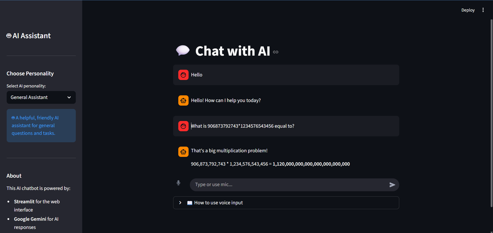

[](https://classroom.github.com/a/Mbf-Zm77)

# Voice AI Assistant

An intelligent AI chatbot with voice input and output capabilities, powered by Google Gemini API.



## 🚀 Live Deployments

Try the app live on multiple platforms:
- **Hugging Face Spaces**: [https://huggingface.co/spaces/Candcie/voice-ai-assistant](https://huggingface.co/spaces/Candcie/voice-ai-assistant)
- **Render**: Coming soon

## Features

- **Voice Input**: Record your voice using the built-in audio recorder with automatic transcription
- **Voice Output**: AI responses are spoken aloud using edge-tts with multiple voice options
- **Text Input**: Type messages directly in the chat interface
- **Multiple AI Personalities**: Choose from 4 different AI personalities:
  - General Assistant - Helpful, friendly AI for general tasks
  - Study Buddy - Encouraging study partner for learning
  - Fitness Coach - Motivating fitness and health advice
  - Gaming Helper - Tips, strategies, and game discussions
- **Multiple TTS Voices**: 4 voice options with British and American accents
- **Audio Waveform Visualization**: See your recorded audio visualized as a waveform
- **Polished User Interface**: Clean white/grey theme with dark shadows
- **Conversation History**: Maintains chat history during the session

## Technologies Used

- **Python** - Core programming language
- **Streamlit** - Web interface framework
- **Google Generative AI (Gemini 2.5 Flash)** - AI responses
- **edge-tts** - Text-to-speech for voice output
- **SpeechRecognition** - Voice transcription
- **audio-recorder-streamlit** - Audio recording component

## Setup

1. Clone this repository:
   ```bash
   git clone <repository-url>
   cd "Voice Ai Assistent"
   ```

2. Install dependencies:
   ```bash
   pip install -r requirements.txt
   ```

3. Create a `.env` file with your Google Gemini API key:
   ```
   GEMINI_API_KEY=your_api_key_here
   ```

4. Run the application:
   ```bash
   streamlit run app.py
   ```

## Requirements

- Python 3.8+
- Google Gemini API key (get one at [Google AI Studio](https://makersuite.google.com/app/apikey))
- Microphone access for voice input
- Internet connection for API calls

## Usage

### Basic Usage
1. Select an AI personality from the sidebar
2. Choose your preferred TTS voice in Voice Settings
3. Either:
   - Click the microphone icon to record your voice, then click again to stop
   - Type your message in the text input box
4. The AI will respond with text and audio
5. Use the audio controls to pause/play the response

### Voice Previews
1. Expand "Voice Settings" in the sidebar
2. Click preview buttons to hear each voice
3. Select your preferred voice for AI responses

### Clear History
- Click "Clear Chat History" in the sidebar to start fresh

## Deployment

For deploying to Render or other cloud platforms, see [DEPLOYMENT.md](DEPLOYMENT.md) for detailed instructions.

**Quick Deploy to Render:**
1. Push to GitHub
2. Connect to Render
3. Add `GEMINI_API_KEY` as environment variable
4. Deploy with: `streamlit run app.py --server.port $PORT --server.address 0.0.0.0`

## Project Structure

```
Voice Ai Assistent/
├── app.py              # Main application
├── components/         # Custom components
│   ├── __init__.py
│   └── audio_waveform.py
├── requirements.txt    # Python dependencies
├── packages.txt        # System dependencies
├── render.yaml         # Render deployment config
├── .env               # API key (not tracked)
├── .env.example       # Example environment file
├── .gitignore         # Git ignore rules
├── DEPLOYMENT.md      # Deployment guide
├── image.png          # Screenshot
└── README.md          # This file
```

## Troubleshooting

- **No audio output**: Ensure your browser allows audio playback
- **Voice not recording**: Check microphone permissions in your browser
- **API errors**: Verify your GEMINI_API_KEY is correct in the .env file

## License

This project is for educational purposes.
